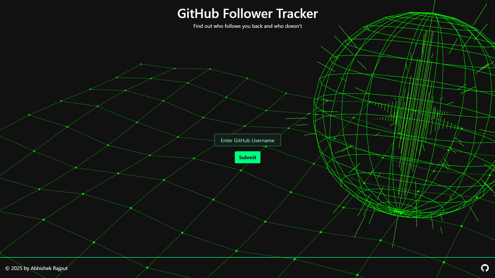

# GitHub Follower Tracker Website

The **GitHub Follower Tracker Website** is a web application designed to efficiently retrieve and display follower and following data for GitHub users. It leverages the GitHub API to provide insights into user relationships on the platform.

## Table of Contents

- [Getting Started](#getting-started)
- [Features](#features)
- [Technical Stack](#technical-stack)
- [Images](#images)
- [Usage](#usage)
- [Author](#author)

## Getting Started

### Prerequisites

- **Python 3.x**
- **Flask** for the web framework
- **Requests** library for HTTP requests

Install the required libraries:

```bash
pip install flask requests
```

### Project Setup

1. **Clone the Repository**:
    ```bash
    git clone https://github.com/YourUsername/github-follower-tracker-website
    ```

2. **Navigate to the Project Directory**:
    ```bash
    cd github-follower-tracker-website
    ```

3. **Run the Application**:
    ```bash
    python app.py
    ```

4. **Access the Web App**:
    Open your browser and go to `http://127.0.0.1:5000`.

## Features

- **Fetch Followers and Following**: Retrieve and display lists of a user's followers and the users they follow.
- **Identify Non-Followers**: List users who are followed but do not follow back.
- **Mutual Followers**: Show users who mutually follow the specified account.
- **Responsive UI**: Designed for optimal performance on both desktop and mobile devices.

## Technical Stack

- **Backend**: Python, Flask
- **HTTP Requests**: Requests library for API interactions
- **Frontend**: HTML, Bootstrap for styling

## Images




## Usage

1. **Input GitHub Username**: Enter a GitHub username on the homepage.
2. **View Results**: Results will display follower and following lists, mutual followers, and non-followers.
3. **Analyze Relationships**: Utilize the organized data for insights into user connections.

## Author

**Abhishek Rajput**

Contributions, feedback, and issue reports are welcome.
